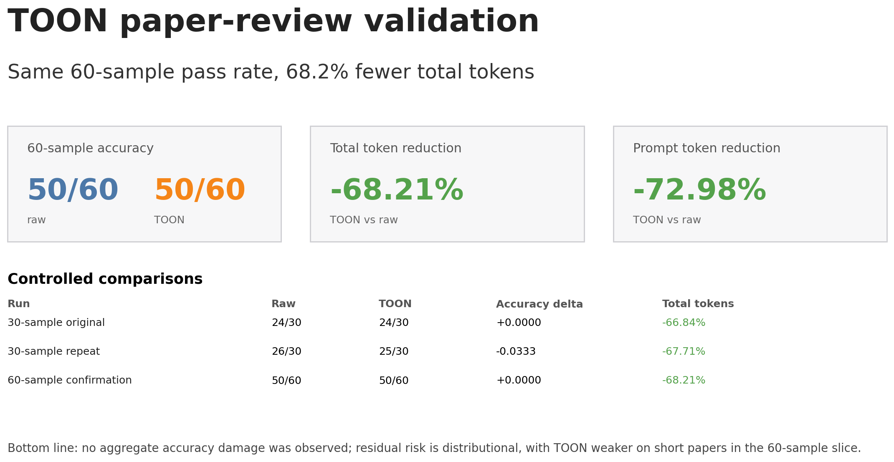
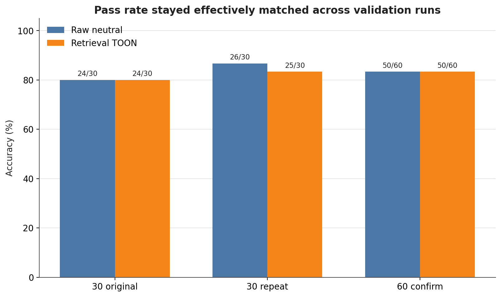
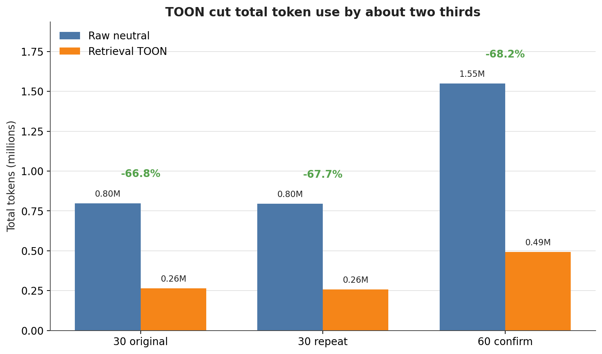
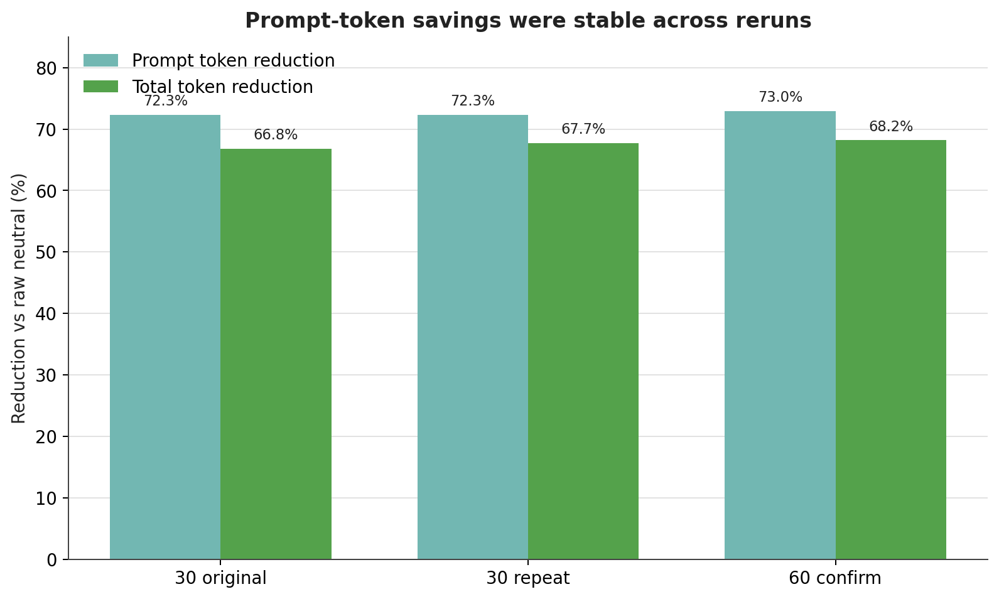
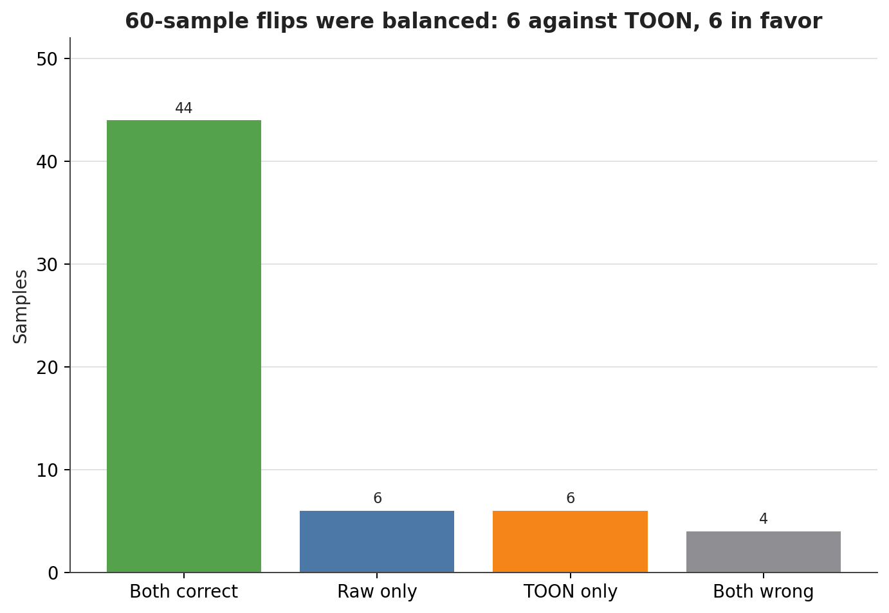
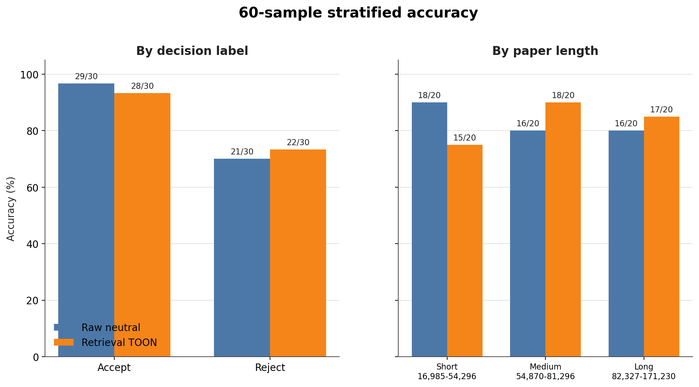

# TOON Paper Review Share Summary

## Headline

On the balanced 60-sample confirmation run, raw neutral and retrieval TOON both scored 50/60 while TOON used 68.21% fewer total tokens.

## Controlled Checks

| comparison | raw | TOON | accuracy delta | total token delta |
| --- | ---: | ---: | ---: | ---: |
| 30-sample original | 24/30 | 24/30 | +0.0000 | -66.84% |
| 30-sample repeat | 26/30 | 25/30 | -0.0333 | -67.71% |
| 60-sample confirmation | 50/60 | 50/60 | +0.0000 | -68.21% |

## Key Takeaways

- No aggregate accuracy damage was observed across the controlled validation runs.
- Total token savings were stable at about 67-68%.
- Prompt-token savings were stable at about 72-73%.
- On the 60-sample run, individual flips were balanced: 6 raw-only correct and 6 TOON-only correct.
- Residual risk: TOON was weaker on the short-paper bucket, offset by medium and long papers.

## Plots

### Executive Summary



### Accuracy Across Runs



### Total Token Use



### Reduction Stability



### 60-Sample Flip Analysis



### 60-Sample Stratified Accuracy



## Regenerate

```bash
UV_CACHE_DIR=/tmp/hyperagents-toon-uv-cache uv run --with matplotlib python scripts/plot_toon_results.py
```
